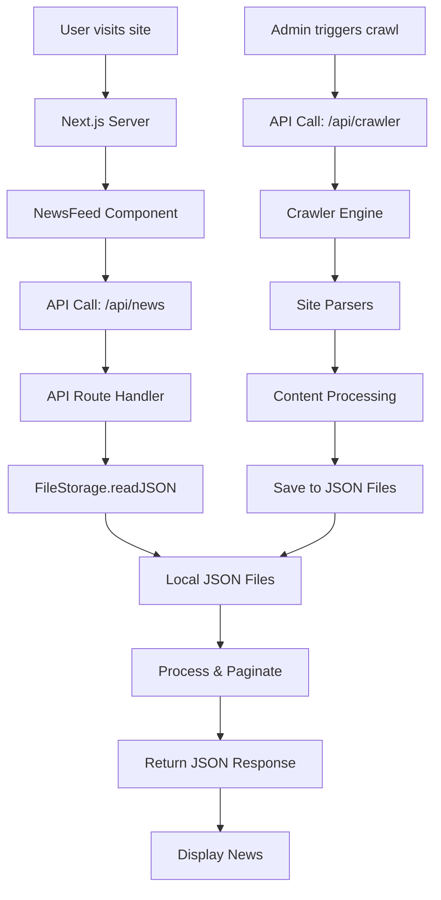
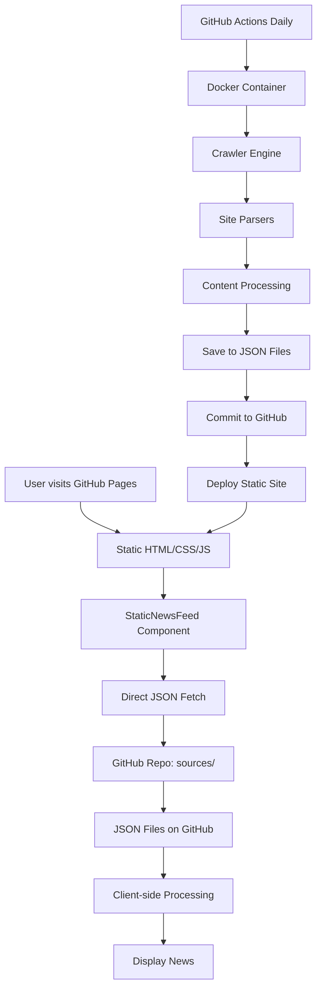
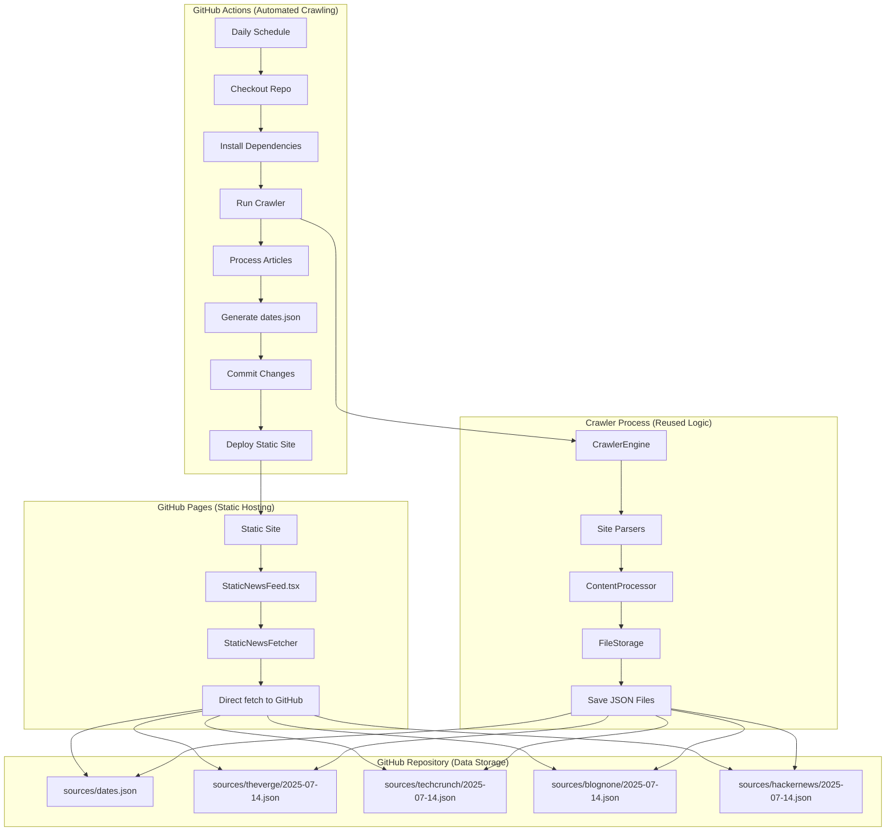
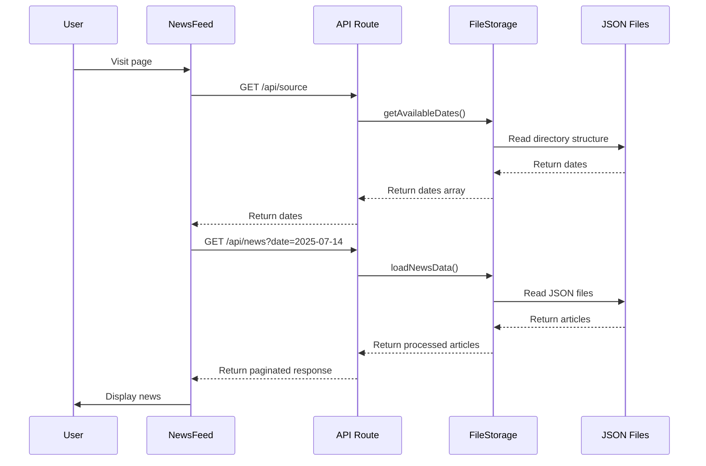
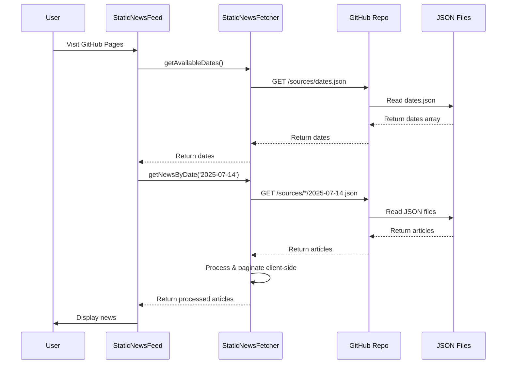
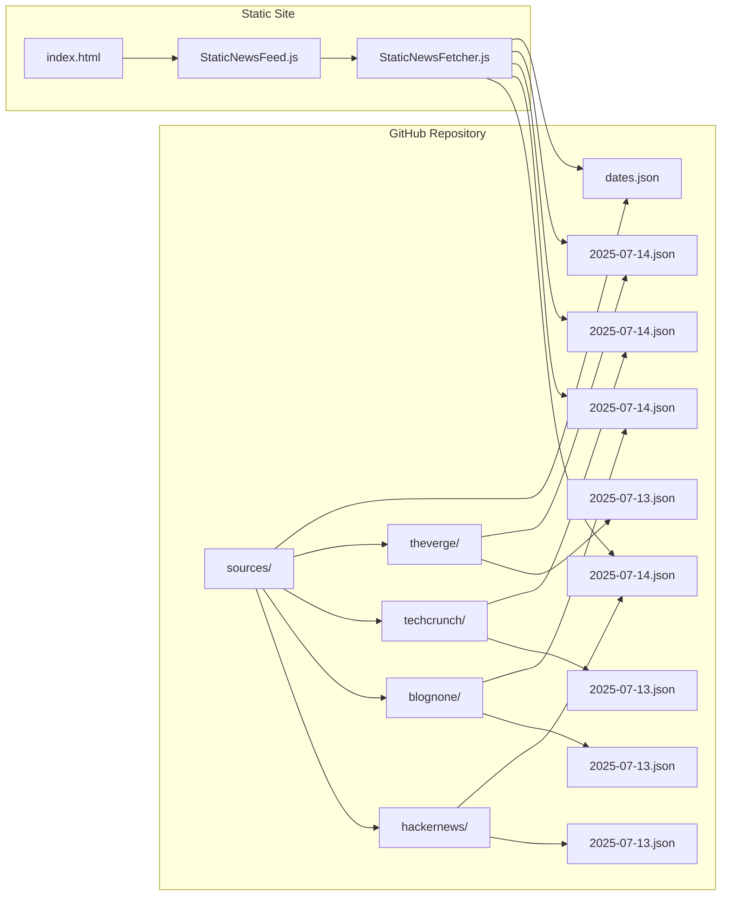
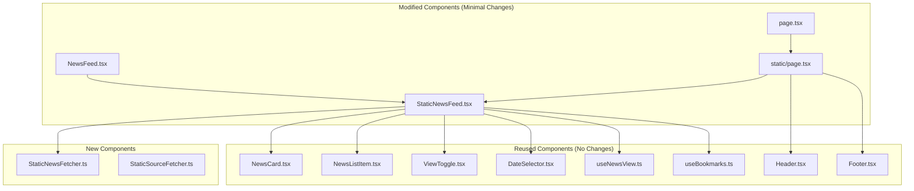
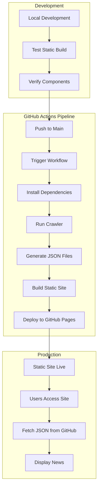
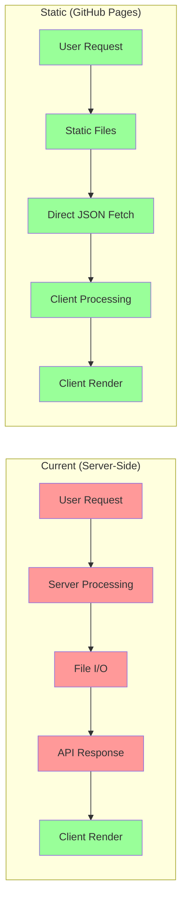
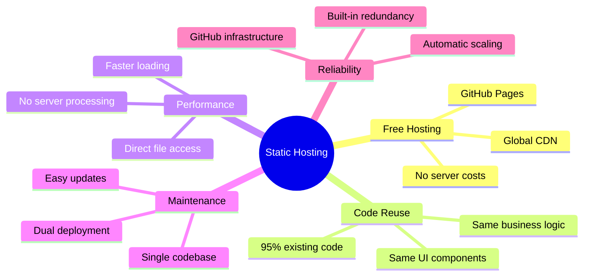

# Static Hosting Flow Diagram

## 🔄 **Current vs Static Architecture Comparison**

### **Current Server-Side Flow:**

### **New Static Flow:**

## 🏗️ **Detailed Static Architecture Flow**

## 🔄 **Data Flow Comparison**

### **Current API Flow:**

### **New Static Flow:**

## 📁 **File Structure Flow**

## 🔧 **Component Reuse Flow**

## 🚀 **Deployment Flow**

## 📊 **Performance Comparison**

## ✅ **Key Benefits Visualization**

